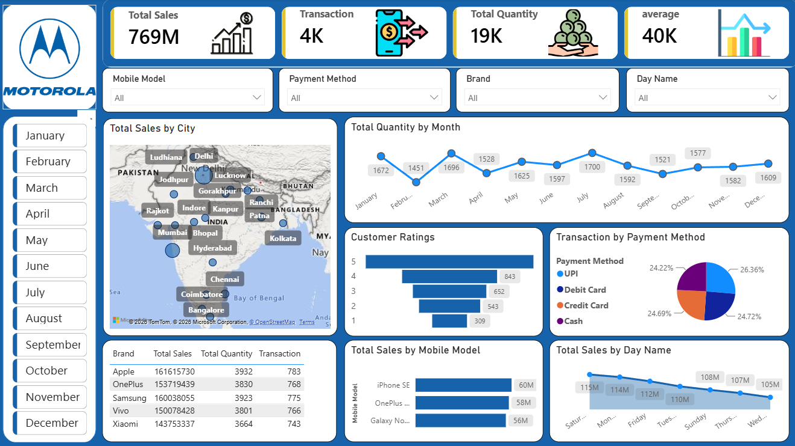

# 📱 Motorola Mobile Sales Dashboard

## 📊 Project Overview

The **Motorola Mobile Sales Dashboard** is an interactive Power BI dashboard designed to analyze mobile sales performance across different cities, mobile models, brands, payment methods, months, customer ratings, and days of the week.

The dashboard provides a consolidated view of key sales KPIs and helps identify sales trends, customer behavior, and product performance.

---

## 🎯 Objectives

* Analyze overall mobile sales performance.
* Track total sales, transactions, and quantity sold.
* Identify monthly sales and quantity trends.
* Analyze sales performance across different cities.
* Compare sales across mobile models and brands.
* Understand customer ratings distribution.
* Analyze transactions by payment method.
* Identify sales patterns across different days of the week.
* Provide interactive filtering for detailed analysis.

---

## 📌 Key KPIs

| KPI                     | Value |
| ----------------------- | ----: |
| **Total Sales**         |  769M |
| **Total Transactions**  |    4K |
| **Total Quantity Sold** |   19K |
| **Average Sales**       |   40K |

---

## 📈 Dashboard Features

### 1. Sales by City

The map visual displays **total sales across different cities in India**, helping identify locations with higher sales performance.

### 2. Monthly Quantity Analysis

The monthly trend shows the **total quantity sold from January to December**, making it easier to identify seasonal patterns and changes in sales volume.

### 3. Customer Ratings

A rating analysis shows the distribution of customer ratings from **1 to 5**, providing insights into customer satisfaction.

### 4. Payment Method Analysis

The dashboard compares transactions across:

* UPI
* Debit Card
* Credit Card
* Cash

### 5. Mobile Model Performance

The dashboard compares **total sales by mobile model**, helping identify the best-performing models.

### 6. Day-wise Sales Analysis

Sales are analyzed across different days of the week to identify daily sales patterns.

### 7. Brand Performance

The dashboard includes a brand-level table showing:

* Brand
* Total Sales
* Total Quantity
* Transactions

Example brands visible in the dashboard include **Apple, OnePlus, Samsung, Vivo, and Xiaomi**.

---

## 🎛️ Interactive Filters

Users can interact with the dashboard using the following filters:

* **Mobile Model**
* **Payment Method**
* **Brand**
* **Day Name**
* **Month**

These filters allow users to drill down into specific segments of the sales data.

---

## 🛠️ Tools & Technologies

* **Power BI**
* **Power Query**
* **DAX**
* **Data Visualization**
* **Data Analysis**

---

## 📊 Visualizations Used

* KPI Cards
* Map Visualization
* Line Charts
* Bar Charts
* Pie/Donut Chart
* Tables
* Slicers/Filters

---

## 💡 Key Insights

The dashboard enables users to identify:

* Overall sales and transaction performance.
* Monthly changes in quantity sold.
* High-performing cities.
* Best-performing mobile models.
* Brand-level sales and quantity performance.
* Customer rating distribution.
* Customer preferences for different payment methods.
* Differences in sales performance across days of the week.

---

## 🖼️ Dashboard Preview



---

## 📁 Project Structure

```text
Motorola-Mobile-Sales-Dashboard/
│
├── Dashboard/
│   └── Motorola_Mobile_Sales.pbix
│
├── Images/
│   └── dashboard.png
│
└── README.md
```

---

## 🚀 How to Use

1. Download or clone this repository.
2. Open the `.pbix` file using **Microsoft Power BI Desktop**.
3. Explore the dashboard using the available slicers and visualizations.
4. Select different brands, mobile models, payment methods, months, and days to perform interactive analysis.

---

## 👤 Author

**Govind Tyagi**

**Data Analyst | Data Scientist**

* GitHub: [Govindtyagi123](https://github.com/Govindtyagi123)
* LinkedIn: [Govind Tyagi](https://www.linkedin.com/in/govind-tyagi-659101335/)
